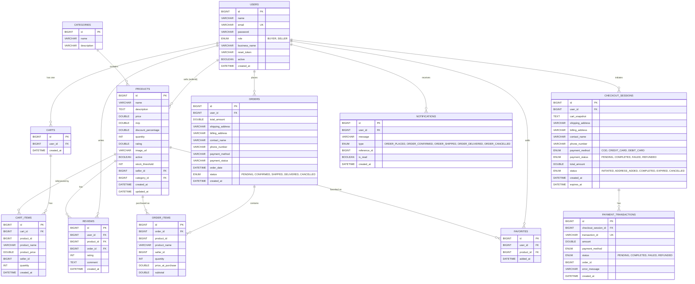

# 📊 Database Schema & Entity Relationship

## 1. ER Diagram (Mermaid)

---

## 2. Table Details

### 2.1 `users` (Auth Service)
| Column        | Type         | Constraints         | Notes                     |
|---------------|--------------|---------------------|---------------------------|
| id            | BIGINT       | PK, AUTO_INCREMENT  | Generated by MySQL        |
| name          | VARCHAR(255) | NOT NULL            | Display name              |
| email         | VARCHAR(255) | NOT NULL, UNIQUE    | Login identifier          |
| password      | VARCHAR(255) | NOT NULL            | BCrypt hashed             |
| role          | ENUM         | NOT NULL            | BUYER or SELLER           |
| business_name | VARCHAR(255) | NULLABLE            | For SELLER accounts       |
| reset_token   | VARCHAR(255) | NULLABLE            | Password reset token      |
| active        | BOOLEAN      | NOT NULL, DEFAULT true | Soft delete flag        |
| created_at    | DATETIME     | NOT NULL            | Auto-set via @PrePersist  |

### 2.2 `products` (Product Service)
| Column              | Type         | Constraints         | Notes                          |
|---------------------|--------------|---------------------|--------------------------------|
| id                  | BIGINT       | PK, AUTO_INCREMENT  |                                |
| name                | VARCHAR(255) | NOT NULL            |                                |
| description         | TEXT(2000)   | NULLABLE            |                                |
| price               | DOUBLE       | NOT NULL            | Selling price                  |
| mrp                 | DOUBLE       | NOT NULL            | Maximum Retail Price           |
| discount_percentage | DOUBLE       | NULLABLE            | Auto-calculated: (mrp-price)/mrp*100 |
| quantity            | INT          | NOT NULL            | Available stock                |
| rating              | DOUBLE       | DEFAULT 0.0         | Average rating                 |
| image_url           | VARCHAR(255) | NULLABLE            | Product image URL              |
| active              | BOOLEAN      | NOT NULL, DEFAULT true |                              |
| stock_threshold     | INT          | NOT NULL, DEFAULT 5 | Low stock warning threshold    |
| seller_id           | BIGINT       | NOT NULL            | FK to users.id (conceptual)    |
| category_id         | BIGINT       | NOT NULL, FK        | FK to categories.id            |
| created_at          | DATETIME     | Auto via Hibernate  | @CreationTimestamp              |
| updated_at          | DATETIME     | Auto via Hibernate  | @UpdateTimestamp                |

### 2.3 `orders` (Order Service)
| Column           | Type         | Constraints         | Notes                     |
|------------------|--------------|---------------------|---------------------------|
| id               | BIGINT       | PK, AUTO_INCREMENT  | This IS the order ID      |
| user_id          | BIGINT       | NOT NULL            | Buyer who placed order    |
| total_amount     | DOUBLE       | NOT NULL            | Server-calculated total   |
| shipping_address | VARCHAR(500) | NOT NULL            |                           |
| billing_address  | VARCHAR(500) | NOT NULL            |                           |
| contact_name     | VARCHAR(100) | NOT NULL            |                           |
| phone_number     | VARCHAR(20)  | NOT NULL            |                           |
| payment_method   | VARCHAR(50)  | NOT NULL            | COD/CREDIT_CARD/DEBIT_CARD|
| payment_status   | VARCHAR(50)  | DEFAULT 'PENDING'   |                           |
| order_date       | DATETIME     | NOT NULL            | Auto-set via @PrePersist  |
| status           | ENUM         | DEFAULT 'PENDING'   | PENDING→CONFIRMED→SHIPPED→DELIVERED |
| created_at       | DATETIME     | NOT NULL            | Auto-set via @PrePersist  |

### 2.4 `order_items` (Order Service)
| Column            | Type         | Constraints        | Notes                          |
|-------------------|--------------|--------------------|--------------------------------|
| id                | BIGINT       | PK, AUTO_INCREMENT |                                |
| order_id          | BIGINT       | FK to orders.id    | @ManyToOne                     |
| product_id        | BIGINT       | NOT NULL           | Reference to product           |
| product_name      | VARCHAR(255) | NOT NULL           | Snapshot at purchase time      |
| seller_id         | BIGINT       | NOT NULL           | Fetched from Product Service   |
| quantity          | INT          | NOT NULL           |                                |
| price_at_purchase | DOUBLE       | NOT NULL           | Price locked at purchase time  |
| subtotal          | DOUBLE       | NOT NULL           | quantity × price_at_purchase   |

### 2.5 `checkout_sessions` (Checkout Service)
| Column           | Type         | Constraints          | Notes                        |
|------------------|--------------|----------------------|------------------------------|
| id               | BIGINT       | PK, AUTO_INCREMENT   | SessionId                    |
| user_id          | BIGINT       | NOT NULL             | Buyer                        |
| cart_snapshot     | TEXT         | NULLABLE             | JSON of cart at checkout time |
| shipping_address | VARCHAR(500) | NULLABLE             | Added in step 2              |
| billing_address  | VARCHAR(500) | NULLABLE             |                              |
| contact_name     | VARCHAR(100) | NULLABLE             |                              |
| phone_number     | VARCHAR(20)  | NULLABLE             |                              |
| payment_method   | ENUM         | NULLABLE             | Set during payment           |
| payment_status   | ENUM         | DEFAULT 'PENDING'    |                              |
| total_amount     | DOUBLE       | NOT NULL             |                              |
| status           | ENUM         | DEFAULT 'INITIATED'  | Lifecycle state              |
| created_at       | DATETIME     | Auto via Hibernate   | @CreationTimestamp            |
| expires_at       | DATETIME     | NOT NULL             | created_at + 30 minutes      |

---

## 3. Key Relationships

| Parent          | Child             | Relationship | Notes                                |
|-----------------|-------------------|--------------|--------------------------------------|
| Cart            | CartItem          | ONE-TO-MANY  | Cascade ALL, orphanRemoval = true    |
| Order           | OrderItem         | ONE-TO-MANY  | Cascade ALL, orphanRemoval = true    |
| Category        | Product           | ONE-TO-MANY  | FetchType.EAGER                      |
| CheckoutSession | PaymentTransaction| ONE-TO-MANY  | Linked by checkoutSessionId          |
| User            | Order             | ONE-TO-MANY  | Linked by userId (no JPA FK)         |
| Product         | Review            | ONE-TO-MANY  | Linked by productId (no JPA FK)      |
